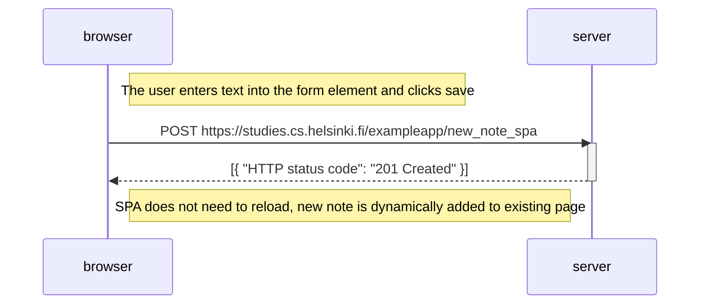

```mermaid
sequenceDiagram
    participant browser
    participant server

    Note right of browser: The user enters text into the form element and clicks save

    browser->>server: POST https://studies.cs.helsinki.fi/exampleapp/new_note_spa
    activate server
    server-->>browser: [{ "HTTP status code":  "201 Created" }]
    deactivate server

    Note right of browser: SPA does not need to reload, new note is dynamically added to existing page
```